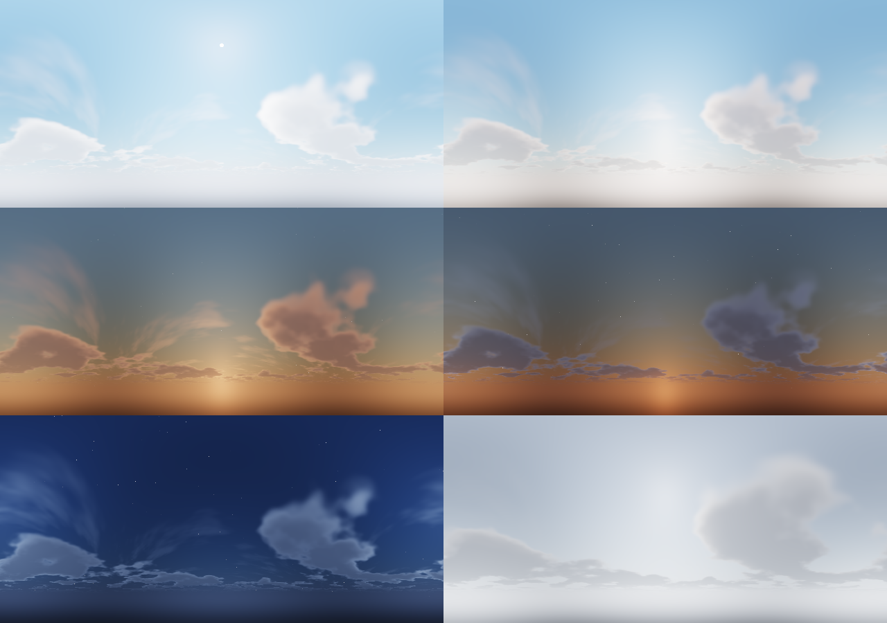

# Clarity: a Minecraft shader pack



A shader pack that looks good without getting in the way of play. It's tuned so an RTX 5080 holds a locked 120 fps on Lunar Client with room to spare. It works on both of Lunar's shader paths:

- **1.8.9 / 1.12** (OptiFine shaders)
- **1.16 to 1.21+** (Sodium + Iris shaders)

## What it looks like

**Sky and weather**
- **Physically based sky:** Rayleigh and Mie scattering with ozone absorption, so blue noons, gold-orange sunsets and deep blue twilight all come out of one model. There are no hand-picked gradients.
- **Procedural clouds:** a drifting cumulus layer lit from the sun's direction, bright on top, orange at sunset and silver-edged against the sun, plus a thin, high cirrus layer. The clouds cast **moving shadows on the ground**.
- **Sky details:** a round sun disc with limb darkening, and **procedural stars** that twinkle and turn with the sky. The vanilla moon and its phases are kept.
- **Volumetric light:** sun shafts are traced through the shadow map, so they come through trees and windows, plus light rays underwater. They are strongest at dawn and dusk and subtle at noon.
- **Height haze:** thicker in valleys, at dawn and in rain, using the same sky colour as the horizon, so the edge never shows a seam.
- **Rain:** surfaces darken, and up-facing blocks gather puddles that reflect the sky.

**Water**
- **Real water, not a tinted texture:** refraction, colour absorbed with depth (shallows are turquoise, deep water is blue), screen-space reflections of terrain, sky and clouds, a sharp sun glint and **caustics** on the floor.
- **From below:** you see the world above through a Snell's window, and total internal reflection beyond it.

**Lighting**
- **Contact-hardening shadows (PCSS):** sharp where objects meet the ground, softer farther out. Stained glass casts coloured shadows.
- **SSAO:** soft occlusion in corners and under objects. It only darkens indirect light, so sunlit faces stay crisp.
- **Auto exposure:** brightness adapts to what you look at, like your eyes do, with a gentle night-time colour shift.
- **Warm torch light and glowing light sources,** filmic tonemapping (ACES) with bloom, FXAA and contrast-limited sharpening. There is no TAA, so nothing ghosts.

## What it deliberately leaves out, for gameplay

- No motion blur, depth of field, vignette, chromatic aberration or lens flares.
- **Caves are never pitch black.** A minimum-light floor applies where there is no sky light, and exposure rises when you go underground. You can still see cave walls and mobs, and the mood stays.
- **Nights stay readable:** moonlight is blue and fairly bright.
- **Clear underwater view:** about 48 blocks, and the vanilla underwater overlay is off.
- **Rain is lighter** (55% opacity), and fog only starts near your render distance.
- The block outline, hurt flash, creeper flash, night vision and blindness all behave as in vanilla.
- The procedural clouds sit high in the sky (y=240) instead of vanilla's y=128 slab, so they never block building or bridging.
- A **Competitive** profile keeps the lighting but turns off wind, volumetric light, haze, cloud shadows and bloom for PvP.

## Install on Lunar Client

1. Download `dist/Clarity.zip` from this folder.
2. Launch Lunar and open a world.
   - **1.8.9:** Options → Video Settings → Shaders.
   - **Modern versions:** Lunar settings → Shaders (Iris). Enable shader support if Lunar asks.
3. Click **Shaders Folder** and drop `Clarity.zip` into it. Don't unzip it.
4. Select **Clarity**. The default profile, **RTX 5080 (120 fps)**, is already selected.

Go to **Shader Options** to adjust anything. Every setting has a readable name, and the menu is split into Lighting, Shadows, Wind, Water, Sky & Fog and Camera.

## Settings for a locked 120 fps

Minecraft is almost always limited by the CPU, not the GPU. A 5080 runs this pack's GPU work in a few milliseconds, so these settings matter most:

| Setting | Value |
| --- | --- |
| Max framerate (Lunar / Video Settings) | **120**, or your monitor's refresh rate if higher |
| VSync | **Off** (cap the frame rate instead) |
| Render distance | **12 to 16 chunks** (1.8.9: 12) |
| Simulation distance (modern) | 8 to 10 |
| Clouds | Any (the pack draws its own) |
| Mipmap levels | 4 |
| Fast Render (OptiFine 1.8.9) | Off (it doesn't work with shaders) |
| RAM allocated in the Lunar launcher | 4 GB for 1.8.9, 6 to 8 GB for modern versions |
| NVIDIA Control Panel → Power management | Prefer maximum performance |
| NVIDIA Control Panel → Low latency mode | On |

Shadows cost CPU as well as GPU, because the world is drawn a second time from the sun's view. If you ever drop below 120 fps in heavy areas, lower **Shadow Distance** (112 → 96) first. Next, switch to the **Balanced** profile. The **Cinematic** profile (4096 shadows, 192 blocks) is for screenshots.

## Profiles

| Profile | Shadows | Extras |
| --- | --- | --- |
| Competitive | 1536 px, 80 blocks, 8 samples | No wind, volumetrics, haze, cloud shadows, bloom or puddles. Brighter caves. |
| Balanced | 2048 px, 96 blocks, 8 samples | Everything on, lighter volumetrics |
| **RTX 5080 (default)** | 2048 px, 112 blocks, 12 samples, PCSS | Everything on |
| Cinematic | 4096 px, 192 blocks, 24 samples | Everything on, 24-step volumetrics |

## Layout

```
Clarity/shaders/
  lib/settings.glsl      every user option (this is what the menu reads)
  lib/common.glsl        uniforms, packing, noise, screen/view helpers
  lib/atmosphere.glsl    sky scattering, sun/moon light, clouds, stars, sun disc
  lib/lighting.glsl      PCSS shadows and the surface lighting model
  lib/water.glsl         wave normals and caustics
  lib/fog.glsl           haze, border fog, underwater extinction
  lib/waving.glsl        wind
  lib/distort.glsl       shadow-map distortion
  program/*.glsl         the actual programs (each has VSH and FSH halves)
  *.vsh / *.fsh          generated stubs: overworld
  world-1/ world1/       generated stubs: Nether / End
  block.properties       which blocks sway, glow or are water
  shaders.properties     menu layout, profiles, pipeline flags
  lang/en_US.lang        option names
tools/build.py           regenerates stubs, validates, zips
tools/preview/           renders the sky library to PNG in headless Chromium
```

After editing, run:

```bash
python3 tools/build.py --check   # compiles every stage for all 3 dimensions with glslangValidator, then zips
```

To preview the sky at six times of day, run this in `tools/preview` (it needs `npm i -g playwright`):

```bash
python3 sky_times.py > tiles.json
NODE_PATH=$(npm root -g) node render.cjs sky.glsl sky.png 640 300 "$(cat tiles.json)"
```

### Pipeline

| Stage | What it does |
| --- | --- |
| `gbuffers_*` | Lights each surface as it is drawn: PCSS shadows, cloud shadows, sky and torch light, wetness. Also writes normals and each pixel's share of indirect light for SSAO. Water only writes its surface data. |
| `composite` | SSAO (8 samples, hemisphere) |
| `composite1` | Depth-aware AO blur and resolve. The water pass: refraction, absorption, caustics, SSR, Fresnel and glint. Fog and haze. Volumetric light march. |
| `composite2` | Depth-aware blur of the volumetric light, added to the scene |
| `composite3` | Bloom from the mip chain, auto exposure (log-average, persistent buffer), tonemap, grade |
| `final` | FXAA, sharpening, dither |
