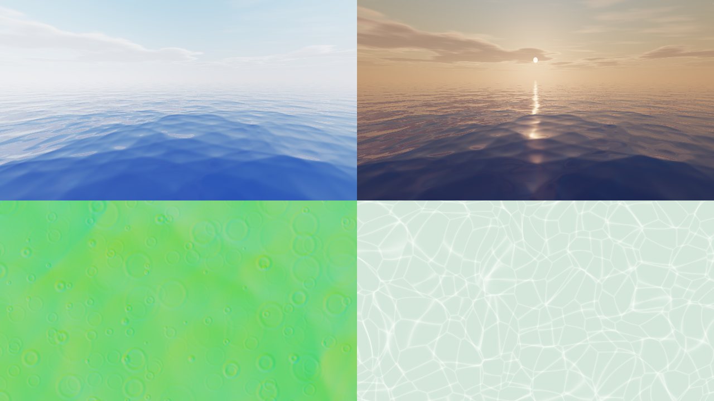

# Clarity: a Minecraft shader pack


A shader pack that looks good without getting in the way of play. It's tuned so an RTX 5080 holds a locked 120 fps on Lunar Client with room to spare. It works on both of Lunar's shader paths:

- **1.8.9 / 1.12** (OptiFine shaders)
- **1.16 to 1.21+** (Sodium + Iris shaders)

## What it looks like

**Sky and weather**
- **Physically based sky:** Rayleigh and Mie scattering with ozone absorption, so blue noons, gold-orange sunsets and deep blue twilight all come out of one model. There are no hand-picked gradients.
- **Procedural clouds:** a drifting cumulus layer lit from the sun's direction, bright on top, orange at sunset and silver-edged against the sun, plus a thin, high cirrus layer. The clouds cast **moving shadows on the ground**.
- **Sky details:** a round sun disc with limb darkening, and **procedural stars** that twinkle and turn with the sky. The vanilla moon and its phases are kept.
- **Volumetric light:** sun shafts are traced through the shadow map, so they come through trees and windows, plus light rays underwater. They are strongest at dawn and dusk and subtle at noon.
- **Height haze:** thicker in valleys, at dawn and in rain, using the same sky colour as the horizon, so the edge never shows a seam.
- **Rain:** surfaces darken, and up-facing blocks gather puddles that reflect the sky.

**Water**



- **Wind-driven waves:** a stack of sharp-crested wave octaves that drag each other, so small chop bunches on the big swells. Distant water drops detail, so it stays calm instead of shimmering.
- **Real water, not a tinted texture:** refraction, and colour absorbed with depth, so shallows are turquoise and deep water is blue.
- **Reflections:** screen-space reflections of terrain, sky and clouds. In the RT profile, ray-traced reflections fill in things that are off screen.
- **Light:** a sharp sun glint that breaks up across the waves, sunlight glowing through wave crests when you face the sun, and web-like **caustics** on the floor. You also see caustics on everything around you while swimming.
- **Surface details:** **shore foam** where the water gets shallow, and **raindrop ripples** in rain.
- **From below:** you see the world above through a Snell's window, and total internal reflection beyond it.

**Lighting**
- **Contact-hardening shadows (PCSS):** sharp where objects meet the ground, softer farther out. Stained glass casts coloured shadows.
- **SSAO:** soft occlusion in corners and under objects. It only darkens indirect light, so sunlit faces stay crisp.
- **Auto exposure:** brightness adapts to what you look at, like your eyes do, with a gentle night-time colour shift.
- **Warm torch light and glowing light sources,** filmic tonemapping (ACES) with bloom, FXAA and contrast-limited sharpening. There is no TAA, so nothing ghosts.

## Ray tracing (optional RT profile)

Choose the **Ray Traced (Iris)** profile. This needs **Iris 1.6 or newer (Minecraft 1.20+)**, which provides custom images and the `at_midBlock` attribute, and OpenGL 4.3 (Windows or Linux; macOS isn't supported). It doesn't work with OptiFine on 1.8.9. On an older Iris the profile still loads, but it falls back to sky-light estimates.

How it works:

- **Voxelization:** the shadow pass writes every block within 64 blocks of you into a 128³ voxel grid. Each voxel is one packed value: the block's colour, its material (solid, leaves, full light source or small light source) and its sky light. It is written with `imageAtomicMax`, so the result is the same every frame (no flicker), and the face with the most sky light wins, so a grass block reads as its green top.
- **Tracing:** each pixel fires cosine-weighted rays through that grid. A ray that hits a block returns the light on that block: sunlight (with shadows), sky light scaled by the voxel's own sky level (so sealed caves stay dark), its colour, and its own glow if it's a light source. Single-sample outliers are clamped, so light sources don't leave firefly speckles. A ray that reaches open air returns the sky; one that runs off the grid falls back to the raster estimate.
- **Result:** sky light is truly occluded, so interiors, overhangs and caves get the right darkness. Sunlight bounces off the ground and walls with colour bleeding, glowing blocks light their surroundings, and leaves let dappled light through.
- **Denoising:** 10 frames of reprojected temporal accumulation (rejected on depth *and* normal changes) plus three à-trous passes. Their edge-stopping uses plane distance, so floors seen at a grazing angle still denoise cleanly. At 120 fps, 10 frames is about 80 ms of light lag. You can change it with **Temporal Frames**.
- **Entities:** mobs and players keep the raster sky light, so moving things never ghost or show 1-sample noise.
- **Off-screen water reflections:** reflections that screen-space tracing can't find are traced through the same voxel grid.
- **What stays rasterised:** sun shadows (PCSS) and torch light stay as they are. They're sharp, stable and lag-free.

Things to know:

- Keep **Shadow Distance** at 112 or more in the RT profile: the shadow pass is what builds the voxel grid, and it must reach the grid's corners. The RT profile also turns shadow-chunk culling off for the same reason.

- Beyond the voxel range (64 blocks), lighting fades back to the normal estimate.
- Glass and water don't block rays, and entities aren't in the voxel grid.
- You'll see a little noise while light settles, especially in dim places.

**Performance:** one ray per pixel, three denoise passes, full resolution. On an RTX 5080 at 1440p this costs roughly 2–4 ms on top of the default profile, so 120 fps holds with the normal settings. At 4K, set **Rays per Pixel** to 1 (the default) and lower **Ray Length** if needed.

## What it deliberately leaves out, for gameplay

- No motion blur, depth of field, vignette, chromatic aberration or lens flares.
- **Caves are never pitch black.** A minimum-light floor applies where there is no sky light, and exposure rises when you go underground. You can still see cave walls and mobs, and the mood stays.
- **Nights stay readable:** moonlight is blue and fairly bright.
- **Clear underwater view:** about 48 blocks, and the vanilla underwater overlay is off.
- **Rain is lighter** (55% opacity), and fog only starts near your render distance.
- The block outline, hurt flash, creeper flash, night vision and blindness all behave as in vanilla.
- The procedural clouds sit high in the sky (y=240) instead of vanilla's y=128 slab, so they never block building or bridging.
- A **Competitive** profile keeps the lighting but turns off wind, volumetric light, haze, cloud shadows and bloom for PvP.

## Install on Lunar Client

1. Download `dist/Clarity-<version>.zip` from this folder (the version is also shown at the top of Shader Options, so you can confirm the right build is loaded).
2. Launch Lunar and open a world.
   - **1.8.9:** Options → Video Settings → Shaders.
   - **Modern versions:** Lunar settings → Shaders (Iris). Enable shader support if Lunar asks.
3. Click **Shaders Folder** and drop the zip into it. Don't unzip it. When updating, delete the old Clarity zip first.
4. Select the Clarity zip, then pick your profile (4K 60, 4K 120 or 1440p 120) under Shader Pack Settings → Profile. 4K 120 is the default.

Go to **Shader Options** to adjust anything. Every setting has a readable name, and the menu is split into Lighting, Shadows, Wind, Water, Sky & Fog and Camera.

## Settings for a locked 120 fps

Minecraft is almost always limited by the CPU, not the GPU. A 5080 runs this pack's GPU work in a few milliseconds, so these settings matter most:

| Setting | Value |
| --- | --- |
| Max framerate (Lunar / Video Settings) | **120**, or your monitor's refresh rate if higher |
| VSync | **Off** (cap the frame rate instead) |
| Render distance | **12 to 16 chunks** (1.8.9: 12) |
| Simulation distance (modern) | 8 to 10 |
| Clouds | Any (the pack draws its own) |
| Mipmap levels | 4 |
| Fast Render (OptiFine 1.8.9) | Off (it doesn't work with shaders) |
| RAM allocated in the Lunar launcher | 4 GB for 1.8.9, 6 to 8 GB for modern versions |
| NVIDIA Control Panel → Power management | Prefer maximum performance |
| NVIDIA Control Panel → Low latency mode | On |

Shadows cost CPU as well as GPU, because the world is drawn a second time from the sun's view. Block entities (chests, signs) are left out of the shadow pass, and entity shadows can be turned off (**Entity Shadows**). If you ever drop below 120 fps in heavy areas, lower **Shadow Distance** (112 → 96) first, but not in the RT profile, which needs 112. Next, switch to the **Balanced** profile. The **Cinematic** profile (4096 shadows, 192 blocks) is for screenshots.

## Changes after the review

Three independent reviews (pipeline correctness, visual quality, performance and gameplay) led to these changes:

**Performance**
- A PCSS early-out on sunlit ground, and the coloured-shadow pass runs only where glass could matter.
- Sky and cloud lighting constants are computed once per frame, not per pixel.
- Exposure metering runs once per frame.
- The RT denoiser reads stored depth and normals.
- Ray and reflection traces are capped.
- The shadow pass stops drawing water, and skips block entities.

**Gameplay**
- Eye adaptation reacts within about 1 s (was the 10 s default).
- Exposure ignores the sky, so looking up no longer darkens the ground.
- Sun shafts can't wash out players against a sunset.
- No sky haze inside caves.
- The night colour shift spares lights.
- Competitive also drops auto exposure, caustics, entity shadows and twinkling.

**Visuals**
- Water refraction bends the actual view ray.
- Light is absorbed on its way down to the floor as well as on its way back up.
- Caustics focus light instead of adding it.
- Reflections keep marching past thin objects.
- The sun glint has proper Fresnel and softens in the distance.
- No dark band at the world edge.
- Raster mode gets a warm ground-bounce fill.

## Profiles

| Profile | Shadows | Extras |
| --- | --- | --- |
| Competitive | 1536 px, 80 blocks, 8 samples | No wind, volumetrics, haze, cloud shadows, bloom or puddles. Brighter caves. |
| Balanced | 2048 px, 96 blocks, 8 samples | Everything on, lighter volumetrics |
| **RTX 5080 (default)** | 2048 px, 112 blocks, 12 samples, PCSS | Everything on |
| Ray Traced (Iris) | 2048 px, 112 blocks, 12 samples, PCSS | Everything on, plus ray-traced sky and bounce light, and ray-traced water reflections |
| Cinematic | 4096 px, 192 blocks, 24 samples | Everything on, 24-step volumetrics |

## Layout

```
Clarity/shaders/
  lib/settings.glsl      every user option (this is what the menu reads)
  lib/common.glsl        uniforms, packing, noise, screen/view helpers
  lib/atmosphere.glsl    sky scattering, sun/moon light, clouds, stars, sun disc
  lib/lighting.glsl      PCSS shadows and the surface lighting model
  lib/water.glsl         waves, rain ripples, caustics
  lib/voxel.glsl         voxel grid mapping, ray traversal (DDA), hit shading
  lib/fog.glsl           haze, border fog, underwater extinction
  lib/settings_clouds.glsl, settings_rt.glsl, settings_post.glsl  feature options
  lib/rt.glsl            shared ray-tracing helpers (reprojection, upsampling, noise)
  lib/noise.glsl         blue-noise lookup (with an IGN fallback)
  lib/bloom.glsl         B-spline bloom from the mip chain
  lib/waving.glsl        wind
  lib/distort.glsl       shadow-map distortion
  program/*.glsl         the actual programs (each has VSH and FSH halves)
  *.vsh / *.fsh          generated stubs: overworld
  world-1/ world1/       generated stubs: Nether / End
  block.properties       which blocks sway, glow or are water
  shaders.properties     menu layout, profiles, pipeline flags
  lang/en_US.lang        option names
  textures/bluenoise.png 128x128, 4 independent blue-noise channels (tools/gen_bluenoise.cjs)
tools/build.py           regenerates stubs, validates, zips
tools/preview/           renders the sky and water code to PNG in headless Chromium
```

After editing, run:

```bash
python3 tools/build.py --check   # compiles every stage for all 3 dimensions with glslangValidator, then zips
```

To preview the sky at six times of day, run this in `tools/preview` (it needs `npm i -g playwright`):

```bash
python3 sky_times.py > tiles.json
NODE_PATH=$(npm root -g) node render.cjs sky.glsl sky.png 640 300 "$(cat tiles.json)"
```

### Pipeline

| Stage | What it does |
| --- | --- |
| `gbuffers_*` | Lights each surface as it is drawn: PCSS shadows, cloud shadows, sky and torch light, wetness. Also writes normals and each pixel's share of indirect light for SSAO. Water only writes its surface data. |
| `prepare` | Volumetric clouds, raymarched once per frame before terrain at reduced resolution into colortex11, blended with the previous frame (sky only) |
| `shadow` | Shadow map. In RT mode it also voxelizes terrain into a 3D image (GLSL 4.30 `imageStore`). |
| `deferred` to `deferred5` | RT only. `deferred` traces at the chosen rate (every pixel, checkerboard, or 1 in 4). `deferred1` upsamples edge-aware and accumulates over time. `deferred2` is the first à-trous pass, with a variance estimate, YCoCg history clamp and history feedback. `deferred3` and `deferred4` are variance-guided à-trous at steps 2 and 4. `deferred5` adds albedo × indirect light. |
| `composite` | SSAO (8 samples, hemisphere; off in RT mode) |
| `composite1` | Depth-aware AO blur and resolve. The water pass: refraction, absorption, caustics, foam, crest glow, SSR with RT fallback, Fresnel and glint. Underwater caustics. Fog and haze. Volumetric light march. |
| `composite2` | Depth-aware Gaussian blur of the volumetric light, added to the scene. Stores each pixel's bright-only luminance for bloom. |
| `composite3` | B-spline-filtered bloom from the mip chain (thresholded), auto exposure (log-average, persistent buffer), tonemap, grade |
| `final` | FXAA, sharpening, dither |
